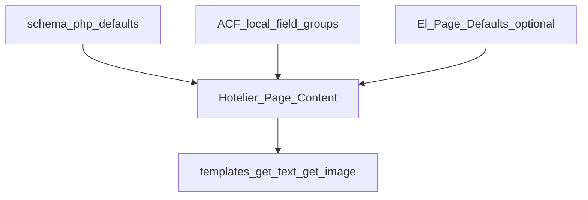

# How To: ACF + Schema — Backend Text and Images the 360 Hotelier Way

This theme treats **Advanced Custom Fields** as an **override layer** on top of **PHP schema defaults** and **Greek fallbacks**. Editors see field groups attached to specific **page templates**; the front end resolves everything through **`Hotelier_Page_Content`** helpers so templates stay simple.

For **step-by-step recipes, naming tables, and seeder behavior**, extend reading with the canonical doc:

**[docs/acf-page-fields-handoff.md](../../docs/acf-page-fields-handoff.md)**

Below is the **structural map** needed to recreate or extend the system.

---

## What it looks like (editor → front end)

1. **`inc/page-meta/schema/*.php`** defines per-page **contexts** (`home`, `about`, `portfolio`, …) with **field keys**, **types** (`text`, `textarea`, `image`), English **`default`** strings or **`default_url`** for images.
2. **`Hotelier_Page_Meta_Schema`** loads those files into a registry.
3. Templates call **`Hotelier_Page_Content::get_text( $post_id, $context, $field_key )`**, **`get_image_url`**, **`get_attachment_id`**, **`get_select`**, etc.
4. Inside those getters, when ACF is registered for that context, **saved ACF meta** wins; otherwise the code falls back to **schema defaults**, then (for Greek UI) **`Hotelier_El_Page_Defaults`** when applicable.
5. **Field group classes** (`Hotelier_Home_Text_Acf_Field`, `Hotelier_Context_Page_Text_Acf_Field`, image counterparts, SEO, hero/CTA specials) call **`acf_add_local_field_group()`** on **`acf/init`** and attach **location rules** (e.g. static front page, specific `page_template`).
6. **Seeders** (home text/image, SEO) run on **`acf/init` priority 20** after registration to push one-time defaults into the database when versions bump.

---

## Dependencies

| Layer | Requirement |
|--------|-------------|
| WordPress | ACF (Pro or Free per your install), optional “ACF Photo Gallery Field” for **`portfolio_gallery`** only |
| Theme | `inc/page-meta/hotelier-page-meta.php` bootstraps schema + field classes |
| Locale | `hotelier_get_current_lang()` (`en` / `el`) from `inc/i18n/hotelier-i18n-bootstrap.php` |

---

## Architecture (conceptual)

---

## File map (high level)

| Concern | Path |
|--------|------|
| Schema registry | `inc/page-meta/class-hotelier-page-meta-schema.php`, `inc/page-meta/schema/*.php` |
| Resolution API | `inc/page-meta/class-hotelier-page-content.php` (`Hotelier_Page_Content`) |
| Registration / wiring | `inc/page-meta/hotelier-page-meta.php` |
| Home text ACF | `inc/page-meta/class-hotelier-home-text-acf-field.php` (mirror for new contexts) |
| Inner-page text ACF | `inc/page-meta/class-hotelier-context-page-text-acf-field.php` |
| Inner-page images ACF | `inc/page-meta/class-hotelier-context-page-image-acf-field.php` |
| Hero / CTA image fields | `class-hotelier-hero-image-field.php`, `class-hotelier-cta-feat-image-field.php` |
| SEO meta | `class-hotelier-seo-meta-field.php` + resolver |
| Greek defaults map | `inc/translations/el/class-hotelier-el-page-defaults.php` |
| Portfolio gallery meta bridge | `inc/admin/portfolio-gallery/class-hotelier-portfolio-gallery-store.php` (separate from `get_image_url` pipeline) |

---

## Naming convention (mental model)

- **Schema key:** short slug in schema file, e.g. `hero_title_line1`.
- **ACF meta (bilingual text example):** often **`hotelier_{context}_{key}_en`** and **`…_el`** for overridable copy (exact mapping per field class — see full doc).
- **Single-language or special fields:** hero image **`hotelier_hero_image`**, CTA **`hotelier_cta_feat_image`**, gallery **`portfolio_gallery`**.

Always align **template `get_text` arguments** with **schema keys**; ACF field definitions must write the meta keys the resolver reads.

---

## Adding a new editable region (checklist)

1. Add keys to the right **`schema-*.php`** with `default` / `label` / `type`.
2. If bilingual: extend **`Hotelier_El_Page_Defaults`** for Greek literals when needed.
3. Create or extend an **`acf_add_local_field_group`** class mirroring **`Hotelier_Home_Text_Acf_Field`** (or add fields to `Hotelier_Context_Page_Text_Acf_Field` if it shares the template).
4. Update **`Hotelier_Page_Content`** resolution branch if the new data shape is not already covered by generic `get_text` / `get_image_url`.
5. Bump **seeder version** if you ship default values to existing installs.
6. Register the class in **`hotelier-page-meta.php`**.

The long-form doc contains a worked **“Add bilingual ACF for About”** example — follow that pattern for other contexts.

---

## Related handoffs

- [Home logo ticker](home-results-logo-ticker.md) (home schema keys for `results_tick_*`)
- [Portfolio gallery](portfolio-two-row-gallery-marquee.md) (`portfolio_gallery` + Store)
- [Portfolio testimonials](portfolio-testimonials-carousel.md) (portfolio text keys + ACF tabs)
