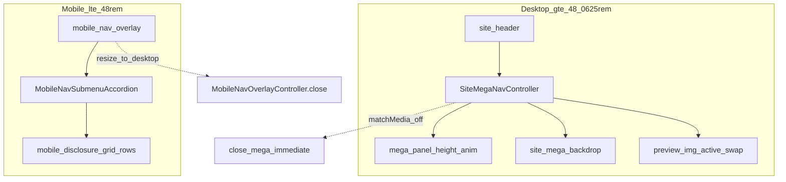

# How To: Site Header, Image Mega Menu, and Mobile Nav (ALB23)

Eleventy-generated marketing chrome: a single sticky-style **site header** row with primary links, **full-width mega panels** (desktop) that show a **preview image** per submenu item, plus a **hamburger + full-screen overlay** on small viewports that reuses the same mega markup as mobile **accordions**. Language and contact sit in a compact **actions** cluster (desktop) or overlay **footer** (mobile).

---

## What It Looks Like

- **Desktop (`min-width: 48.0625rem`):** Horizontal primary nav (`Home`, `Robots`, `ELION`, `About us`). Mega parents use **`href="#"`** + chevron; **click** opens a fixed panel under the bar (`top: var(--site-header-height)`), not hover. A **frosted scrim** (`#site-mega-backdrop`) covers the page below the panel; only the submenu **link column** fades in with a short delay; the **image column** fades slightly later. **Hovering** a product link cross-fades the preview image (default image when the pointer leaves the list).
- **Mobile (`max-width: 48rem`):** Primary row shows brand + hamburger (inline nav links hidden per `site-header.css`). Tapping the hamburger opens **`#mobile-nav`**: same tree as desktop, but mega panels **collapse** with **`MobileNavSubmenuAccordion`** + **`mobile-disclosure.css`** (grid `0fr` → `1fr`). **Preview images are hidden**; only links show, right-aligned in the overlay. **Contact** is a primary CTA in **`mobile-nav__footer`**; **language** is the last row in the mobile list (nested flyout pattern).
- **Not in scope for this site:** A separate “top utility bar” or scroll-driven **`is-scrolled`** masthead shrink (see dental-clinic handoff if you need that pattern). The ALB23 bar is a solid surface with border tokens; behavior is mega + mobile overlay, not dynamic transparency-on-hero unless you add it later.

---

## Dependencies

| Layer | Requirement |
|--------|--------------|
| **Build** | Eleventy + Nunjucks; header from `src/_includes/partials/*.njk` |
| **JS** | ES modules: `js/mobile-nav.js` imports `js/site-mega-nav.js` |
| **CSS** | Design tokens in `css/tokens.css` (`--site-header-height`, `--site-mega-flyout-rate`, `--mega-panel-inner-max`, `--mobile-nav-debounce-ms`, `--mobile-submenu-disclosure-transition`, `--chrome-overlay-blur`, z-index tokens) |
| **Markup contracts** | WordPress-shaped classes: `menu-item`, `menu-item-has-children`, `menu-item-has-mega`, `sub-menu`, `current-menu-item` (for parity and reuse of accordion selectors) |

---

## Architecture (conceptual)



On load, **`initMobileNav()`** wires everything: mega nav, placeholder-link guard, desktop language **`DesktopNavSubmenuToggle`** (`.site-header__lang-menu` only), overlay + accordion.

---

## File map

| Concern | Path |
|--------|------|
| Header + desktop/mobile DOM | `src/_includes/partials/site-header.njk` |
| Contact + language (two variants) | `src/_includes/partials/site-header-actions.njk` |
| Mega: Robots / PadBot + Pudu | `src/_includes/partials/nav-padbot-mega.njk` |
| Mega: ELION | `src/_includes/partials/nav-elion-mega.njk` |
| Language row (desktop + mobile) | `src/_includes/partials/nav-language-submenu.njk` |
| Stylesheet + module order | `src/_layouts/base.njk` |
| Header / overlay chrome | `css/site-header.css`, `css/site-header-toolbar.css`, `css/site-header-dropdowns.css` |
| Mega layout + backdrop | `css/site-mega-nav.css` |
| Mobile accordion animation | `css/mobile-disclosure.css` |
| Mega open/height/backdrop/preview | `js/site-mega-nav.js` |
| Overlay, accordion, lang toggle, init | `js/mobile-nav.js` |
| Extra narrative | `APPLE-MEGA-MENU.md` (project root) |

---

## HTML structure (Eleventy)

Order matters: **`site-header`** first (contains `#site-mega-backdrop`), then **`#mobile-nav`** sibling.

**Header shell** (simplified):

```html
<header class="site-header">
  <div class="site-header__inner container">
    <a class="site-header__brand" href="index.html">…</a>
    <div class="site-header__tools">
      <nav class="primary-navigation" aria-label="Primary">
        <ul class="nav-menu">
          <li class="menu-item menu-item-has-children menu-item-has-mega">
            <a href="#" aria-expanded="false" aria-haspopup="true">
              Robots
              <span class="nav-submenu-chevron" aria-hidden="true">…</span>
            </a>
            <!--  -->
          </li>
          <!-- ELION mega, plain items, … -->
        </ul>
        <button type="button" class="mobile-nav-toggle" aria-controls="mobile-nav" aria-expanded="false" aria-label="Open menu">…</button>
      </nav>
      <!-- site-header-actions: lang + contact (desktop) -->
    </div>
  </div>
  <div class="site-mega-backdrop" id="site-mega-backdrop" aria-hidden="true"></div>
</header>
```

**Mega panel skeleton** (same partial included under each mega `<li>`):

```html
<div class="nav-submenu-clip mega-panel mobile-disclosure__panel" data-mega-clip>
  <div class="mega-panel__body nav-submenu-body mobile-disclosure__inner">
    <div class="mega-panel__height" data-mega-height>
      <div class="mega-panel__surface">
        <div class="container mega-panel__layout">
          <div class="mega-panel__grid">
            <div class="mega-panel__column">
              <!-- eyebrow + ul.mega-panel__list > .menu-item > a -->
            </div>
            <div class="mega-panel__column mega-panel__preview" aria-hidden="true">
              <div class="mega-panel__preview-img mega-panel__preview-img--active">
                <!-- default image: no data-mega-preview-for -->
              </div>
              <div class="mega-panel__preview-img" data-mega-preview-for="PadBot X3">
                <!-- product image -->
              </div>
            </div>
          </div>
        </div>
      </div>
    </div>
  </div>
</div>
```

**Mobile overlay** duplicates the same `<ul class="mobile-nav__links">` items (and includes the same mega partials), then includes **`site-header-actions.njk`** with **`mobileNavFooter = true`** for the overlay CTA.

**Preview image contract**

- The **default** slide is the first `.mega-panel__preview-img` **without** `data-mega-preview-for`, marked **`mega-panel__preview-img--active`**.
- Each optional slide has **`data-mega-preview-for="…"`** whose value must equal the **`textContent`** of the corresponding `.mega-panel__list .menu-item a` (after trim). Prefer wrapping visible label text in **`<span class="mega-panel__link-text">`** so styling does not break the string match.
- **`CSS.escape`** is used when querying by label; avoid characters that break selectors or trim mismatches.

---

## JavaScript behaviors

### 1. `SiteMegaNavController` (`js/site-mega-nav.js`)

- **`initSiteMegaNav()`** requires `.site-header`, `#site-mega-backdrop`, and **`.primary-navigation .nav-menu`** (an `HTMLUListElement`).
- Desktop gate: **`matchMedia("(min-width: 48.0625rem)")`**. Below that, mega anchor clicks are not intercepted; `_onMediaChange` calls **`_closeImmediate()`** when leaving desktop.
- **Click** on `li.menu-item-has-mega > a`: `preventDefault` / `stopPropagation`; toggle **`is-mega-open`** on that `li`, set **`aria-expanded`**, add **`site-header--mega-open`** on the header, show backdrop (`aria-hidden="false"`).
- **Height track**: `[data-mega-height]` animates from `0` to **`surface.scrollHeight`** (respecting **`prefers-reduced-motion`** via instant height). Switching from one open mega to another uses **`mega-panel__height--instant`** to swap without a close animation.
- **Backdrop**: **`_updateBackdropInset`** sets inline `top` to the open panel’s bottom edge so blur/scrim only covers content **below** the dropdown; **`ResizeObserver`** on the panel keeps that in sync.
- **Dismiss**: click outside header mega, backdrop click, **Escape** (when `site-header--mega-open`).
- **Preview swap**: on each mega `li`, **`mouseenter`** on `.mega-panel__list .menu-item a` toggles **`mega-panel__preview-img--active`**; **`mouseleave`** on the list restores the default preview.

### 2. `initMobileNav()` (`js/mobile-nav.js`)

Order of setup:

1. **`initSiteMegaNav()`** — desktop mega + preview behavior.
2. **`initMegaPanelPlaceholderLinks()`** — document-level click handler: **`preventDefault`** for **`a[href='#']`** only when inside **`.mega-panel__list`** (placeholders until real URLs exist).
3. **`DesktopNavSubmenuToggle`** — **only** roots passed are **`.site-header__lang-menu`** (not primary megas).
4. **`MobileNavSubmenuAccordion`** — root **`.mobile-nav__links`**; media **`(max-width: 48rem)`**; toggles **`is-submenu-open`** on **`:scope > .menu-item-has-children`**.
5. **`MobileNavOverlayController`** — hamburger toggles **`is-open`** on `#mobile-nav`, **`aria-*`**, **`body` overflow**, debounce from **`--mobile-nav-debounce-ms`**, **Escape** closes; **resize to desktop** closes overlay and resets submenus.

---

## CSS (behavioral reference)

### Breakpoints

- **Mobile mega overrides:** `@media (max-width: 48rem)` in `css/site-mega-nav.css` — `height: auto !important` on **`.mega-panel__height`**, strip panel surface chrome inside overlay, stack grid, **hide `.mega-panel__preview`**, optional eyebrow hide.
- **Desktop mega + backdrop:** `@media (min-width: 48.0625rem)` — fixed **`.mega-panel`**, inner cap **`var(--mega-panel-inner-max)`**, grid columns, column opacity transitions when **`.is-mega-open`**, preview image crossfade uses **`--site-mega-flyout-rate`** (`css/site-mega-nav.css`); **`--site-mega-backdrop-transition`** drives backdrop opacity.

### Mobile disclosure

- **`css/mobile-disclosure.css`**: under `48rem`, **`.mobile-disclosure__panel`** uses **`grid-template-rows: 0fr`** → **`1fr`** when **`li.is-submenu-open > .mobile-disclosure__panel`**; transition **`var(--mobile-submenu-disclosure-transition)`**.

### Header + overlay

- **`css/site-header.css`**: header min-height vs **`--site-header-height`**, hamburger hit target, overlay **`#mobile-nav.mobile-nav-overlay`** visibility/opacity, mobile link typography, padding reserved for **`mobile-nav__footer`**.
- **`css/site-header-dropdowns.css`**: desktop language flyout (not mega).
- **`css/site-header-toolbar.css`**: toolbar visibility (e.g. actions hidden where the overlay replaces them).

---

## Quick reference checklist (maintaining this feature)

- [ ] Every mega parent is **`menu-item-has-children menu-item-has-mega`** with matching partial include in **both** `.nav-menu` and `.mobile-nav__links`.
- [ ] **`data-mega-preview-for`** strings exactly match link **text** (including multi-list megas such as PadBot + Pudu in one panel).
- [ ] **`#site-mega-backdrop`** remains inside **`.site-header`** after the inner row.
- [ ] **`mobile-disclosure__panel` / `mobile-disclosure__inner`** stay on clip/body so mobile accordion CSS applies.
- [ ] **`base.njk`** still loads **`site-mega-nav.css`**, **`mobile-disclosure.css`**, and **`js/mobile-nav.js`** as **`type="module"`**.
- [ ] New tokens for timing or max width go in **`css/tokens.css`**, not scattered magic numbers.

---

This guide matches the style of sibling “How To” handoff documents under `TEMP/`: portable patterns, file-grounded references, and behavior notes without tying readers to WordPress PHP. For more detail on the desktop mega animation narrative, see **`APPLE-MEGA-MENU.md`**.
